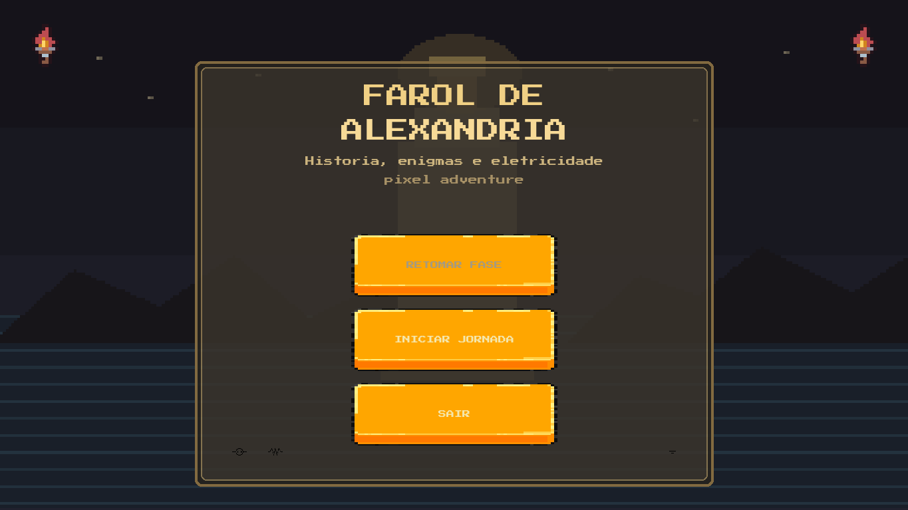

# Lighthouse of Alexandria

**Lighthouse of Alexandria** is a 2D Python/Pygame game that blends exploration, story-driven progression, and electrical circuit analysis challenges.

You play as **Kevin**, moving through enemy-filled stages, locked passages, and interactive electrical panels while trying to prevent a catastrophic shift in Alexandria's timeline.

## Gallery



## Story

Kevin discovers that the Lighthouse of Alexandria stands at the center of an impossible choice: saving the city may cost him his own family history. As the game progresses, electrical panels stop being isolated puzzles and become part of the narrative conflict itself.

Core themes:
- science and engineering as decision-making tools;
- historical consequences shaped by player action;
- a father-and-son relationship on a collision course.

## Current Features

- Top-down exploration across story, combat, and puzzle stages.
- NPC interaction, doors, collectible objects, and scripted scenes.
- Circuit editor with collectible components:
  - resistor;
  - voltage source;
  - current source;
  - nodes, wires, and GND.
- Automatic circuit validation powered by in-memory numerical analysis.
- Bomb mechanics in specific stages, tied to circuit progression.
- Ghost enemies with radial proximity damage and audio chase feedback.
- Fairer fall-ground traps with warning audio and delayed activation.
- English and Portuguese support across UI, dialogue, letters, and explanation content.

## Educational Content

The explanation stages currently cover:
- Ohm's law and electric power;
- resistor association;
- Kirchhoff's laws (KCL/KVL);
- Thevenin and Norton equivalents;
- maximum power transfer.

## Controls

- `W A S D`: movement
- `E`: interact with panels, doors, and objects
- `B`: place bomb when available
- `L`: toggle stage light

In the circuit editor:
- `N`: node
- `W`: wire
- `G`: GND
- `R`: rotate
- `S`: select
- `Delete`: delete
- `Esc`: cancel current tool

## Requirements

- Python `3.11+`
- Runtime dependencies from [`requirements.txt`](requirements.txt):
  - `pygame-ce==2.5.3`
  - `numpy==2.2.5`
  - `PyTMX==3.32`
  - `pathfinding==1.0.18`
- Development dependencies from [`requirements-dev.txt`](requirements-dev.txt):
  - `Pillow>=12.0,<13`
- Optional build dependencies from [`requirements-build.txt`](requirements-build.txt):
  - `pyinstaller==6.16.0`

## Running Locally

1. Create and activate a virtual environment.
2. Install dependencies:

```bash
pip install -r requirements.txt
```

3. Optionally install build tooling:

```bash
pip install -r requirements-build.txt
```

4. Start the game:

```bash
python main.py
```

## Windows Build

Example manual build with PyInstaller:

```powershell
pyinstaller --noconfirm Alexandria.spec
```

For the packaged release flow, see [`BUILD_WINDOWS.md`](BUILD_WINDOWS.md) and the release specs such as [`Alexandria_release.spec`](Alexandria_release.spec).

## Saves and Runtime Data

During development, writable data lives inside `code/`, including JSON v2 circuits and local save snapshots.

In the Windows executable, writable runtime data may be copied to:
- `%LOCALAPPDATA%\Alexandria\code\circuitos`

Old LTspice files already present in a user profile are left untouched, but the game no longer reads or updates them.

Release packages for itch.io are distributed as zip archives that include the executable, the `_internal` folder, and execution instructions in both Portuguese and English.

## Project Structure

- `main.py`: entry point
- `code/game.py`: main loop and scene registration
- `code/scenes/`: game scenes, menus, stages, endings, and circuit editor
- `code/core/`: ECS systems, managers, UI, localization, and map tooling
- `code/circuitos/`: versioned JSON circuit documents
- `assets/`: images, fonts, maps, and audio
- `code/tests/`: automated coverage for gameplay, localization, and regression scenarios

## Tech Stack

- Python + `pygame-ce`
- Custom ECS architecture
- In-memory Modified Nodal Analysis with `numpy`
- Tiled maps via `PyTMX`
- Grid navigation with A* from `pathfinding`

## Status

The project is currently playable end-to-end, with:
- a multi-stage campaign;
- integrated educational circuit content;
- Portuguese/English localization support;
- Windows build and packaging flow;
- automated tests covering localization, fall-ground fairness, and phantom behavior.

## Roadmap

- Continue balancing enemy pressure and bomb-based stages.
- Expand educational content and explanation media.
- Improve release automation for executable and itch.io packaging.
- Refine audiovisual feedback across transitions, hazards, and combat.
